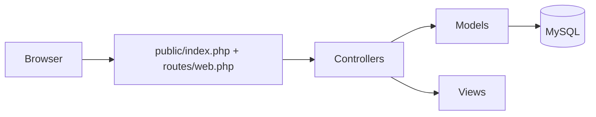

# Store Management Web App


## What is this

This project is an MVC-style PHP store management application for SMB operations: authentication, users/workers management, clients, products, and billing workflows. It exists to demonstrate practical business software engineering with role-based access and operational CRUD flows in a constrained local-deployment environment.

## Why it exists

The goal is to provide a usable business workflow baseline for local shops while showcasing backend logic design, data modeling, and route-level authorization in a complete end-to-end app.

## Architecture / Stack



**Stack:** PHP, MySQL, MVC-like structure, CSS, local server runtime (XAMPP/WAMP/LAMP).

## Installation

### 1) Clone repository

```bash
git clone https://github.com/fbenkhelifa/store-management-webapp.git
cd store-management-webapp
```

### 2) Place project under your web root

- XAMPP: `C:\xampp\htdocs\`
- WAMP: `C:\wamp64\www\`

### 3) Start required services

- Apache (or Nginx with PHP)
- MySQL

### 4) Configure database connection

Edit `BENKHELIFA_FAROUK_G1_IGE46/config/database.php` if needed (host/db/user/password).

### 5) Run application

Open:

`http://localhost/BENKHELIFA_FAROUK_G1_IGE46/public/login`

## Usage

### Example login flow

- Route: `/public/login`
- Method: `POST`
- Payload fields: `username`, `password`

### Example output behavior

- Successful authentication → redirects to `/public/dashboard`
- Invalid credentials → redirects to `/public/login?error=invalid_credentials`

### Functional modules available

- User administration (admin-only)
- Worker management (admin-only)
- Client management
- Product management
- Billing and bill details

## Project structure

```text
store-management-webapp/
├── BENKHELIFA_FAROUK_G1_IGE46/
│   ├── app/
│   │   ├── Controllers/      # Auth, user, worker, client, product, bill controllers
│   │   ├── Models/           # Data access + persistence logic
│   │   └── Views/            # Auth and business pages
│   ├── config/
│   │   └── database.php      # DB bootstrap, schema setup, seed data
│   ├── routes/
│   │   └── web.php           # Route map + authorization checks
│   ├── public/
│   │   ├── index.php         # Entry point
│   │   └── css/              # UI styles
│   ├── README.md
│   └── readme.docx           # Legacy documentation artifact
├── .gitignore
├── LICENSE
└── README.md
```

## Limitations

- Current base path is fixed to `/BENKHELIFA_FAROUK_G1_IGE46/public` in routing.
- App is designed for local deployment; no production deployment profile included.
- No automated tests/CI pipeline in this repository yet.
- Includes educational seed data and backward compatibility with legacy MD5 records.

## Roadmap

1. Externalize configuration with environment variables and `.env.example`.
2. Replace fixed base path with configurable runtime routing.
3. Add CI checks (PHP lint/static analysis) and smoke tests.
4. Add exportable backup/restore workflow for SMB operations.
5. Publish product-grade desktop edition as `store-manager` (offline-first packaging).

## License

Licensed under MIT. See [`LICENSE`](./LICENSE).
